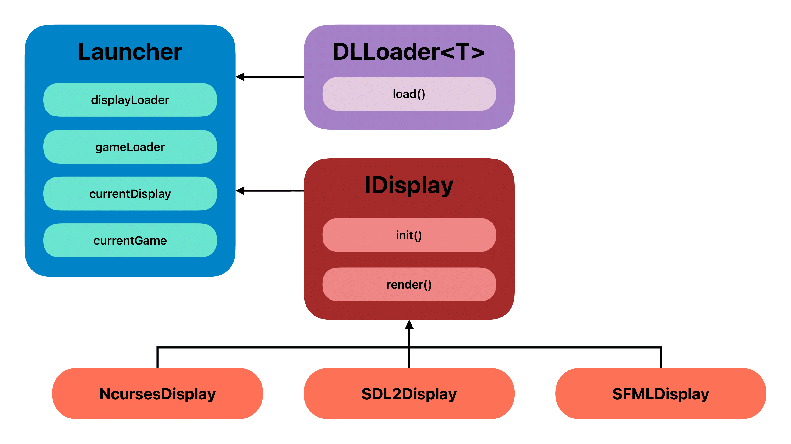

### Documentation for Arcade
---
# 1. How to Implement New Graphics/Game Libraries
## 1.1 Graphics Library Implementation
### Steps to create a new graphical library (e.g., `OpenGL`):

#### 1. Create a class implementing `IDisplay`:
```hpp
// include/MyLib/OpenGLDisplay.hpp
#include "DisplayInterface.hpp"

class OpenGLDisplay : public IDisplay {
public:
    void init() override;
    void close() override;
    void render(const GameState& state) override;
    // ... implement all virtual methods from IDisplay
    static IDisplay* create() { return new OpenGLDisplay(); }
};
```

#### 2. Export the `create` symbol:
```cpp
extern "C" IDisplay* create() {
    return OpenGLDisplay::create();
}
```

#### 3. Compile as a shared library:
```Makefile
# Update Makefile's LIBS_GRAPHIC
LIBS_GRAPHIC = ncurses sdl2 sfml opengl

# Add compilation rule
opengl:
    g++ -shared src/Libs/opengl/opengl.cpp -o lib/arcade_opengl.so
```

#### 4. Place `arcade_opengl.so` in `./lib/`.
Should be architectured like this:
```shell
.
├── Assets
├── Makefile
├── [...]
├── docs
├── lib
│    ├── [...]
│    └── [arcade_opengl.so]
└── src
```
## 1.2 Game Library Implementation
### Steps to create a new game (e.g., `Minesweeper`):

#### 1. Create a class implementing `IGame`:
```hpp
// include/Games/Minesweeper.hpp
#include "GameInterface.hpp"

class Minesweeper : public IGame {
public:
    GameState update() override;
    void handleInput(int key) override;
    std::string getName() const override { return "Minesweeper"; }
    static IGame* create() { return new Minesweeper(); }
};
```

#### 2. Export the `create` symbol:
```cpp
extern "C" IGame* create() {
    return Minesweeper::create();
}
```

#### 3. Compile as a shared library:
```Makefile
# Update Makefile's GAMES
GAMES = pacman snake minesweeper
```

#### 4. Place `arcade_minesweeper.so` in `./lib/`.
Should be architectured like this:
```shell
.
├── Assets
├── Makefile
├── [...]
├── docs
├── lib
│    ├── [...]
│    └── [arcade_minesweeper.so]
└── src
```

# 2. Class Diagram


# 3. Program Flow Manual

#### 1. Initialization:
- The `Launcher` loads the initial graphics library specified in the CLI argument.

- The `Menu` reads available games and libraries from `./lib/`.

#### 2. Menu Interaction:
- Users select games/graphics via keyboard/mouse.

- Scores and usernames are loaded from `./Assets/Stats/`.

#### 3. Game Loop:

- `Launcher` calls `IGame::update()` to get the game state.

- `IDisplay::render()` draws the state using the active graphics library.

- Inputs are forwarded to `IGame::handleInput()`.

#### 4. Dynamic Switching:
- Pressing keys (e.g., `O/P`) switches graphics libraries at runtime via `dlopen`.
#### Key Bindings:
- `I/O/P`: Switch graphics library
- `↑/↓/←/→`: Navigate in games
- `Q`: Quit
